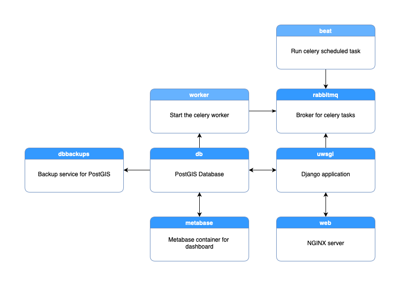

# Introduction


This directory contains the source code for the plugin repository server used by
the QGIS project.

This software is open source and licensed under GNU General Public License v2.0.
For licensing information, please read the COPYING file included in this directory.

## Important Note

***This repository is dedicated solely to the QGIS Plugins Website (plugins.qgis.org). For issues related to specific plugins or other concerns, please use the respective bug tracker.***

## Installation

For setup, installation and backup notes, please read [INSTALL](INSTALL.md) included in this directory.

To contribute to this project, please contact Tim Sutton - tim@kartoza.com


QGIS Django Project
Tim Sutton 2010

## Admin

QGIS versions are updated automatically from a scheduled task. To update QGIS versions manually, go to **[Admin](https://plugins.qgis.org/admin/)** -> **[Site preferences](https://plugins.qgis.org/admin/preferences/sitepreference/)**.

## Tech stack



This application is based on Django, written in Python and deployed on the server using
docker-compose.

## Token based authentication

Users can generate a Simple JWT token by providing their credentials, which can then be utilized to access endpoints requiring authentication.
Users can create specific tokens for a plugin at `https://plugins.qgis.org/<package_name>/tokens/`.


```sh
# A specific plugin token can be used to upload or update a plugin version. For example:
curl \
  -H "Authorization: Bearer the_access_token" \
  https://plugins.qgis.org/plugins/api/<package_name>/version/add/ \
  -F "package=@/path/to/valid_plugin_0.0.1.zip"

curl \
  -H "Authorization: Bearer the_access_token" \
  https://plugins.qgis.org/plugins/api/<package_name>/version/<version>/update \
  -F "package=@/path/to/valid_plugin_0.0.2.zip"
```

## Contributing

Please contact tim@kartoza.com if you want to contribute, or simply make a Pull Request or Issue report.

## QGIS.org

This project is part of the QGIS community effort to make the greatest GIS application in the world.
Join our efforts at [QGIS.org](https://qgis.org).
